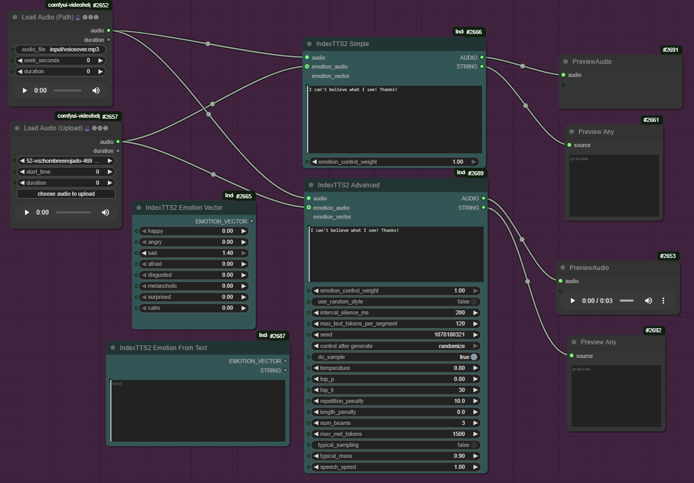

ComfyUI-IndexTTS2
=================

Lightweight ComfyUI wrapper for IndexTTS 2 (voice cloning + emotion control). The nodes call the original IndexTTS2 inference and keep behavior faithful to the repo.

Original repo: https://github.com/index-tts/index-tts

## Updates
- Update 2025-09-14: Added IndexTTS2 Advanced node exposing sampling, speed, seed, and other generation controls.

Install
- Clone this repository to: ComfyUI/custom_nodes/
- In your ComfyUI Python environment: 
  ```bash
  pip install wetext
  pip install -r requirements.txt
  ```

Models (checkpoints)
- Create a folder named 'checkpoints' in the root directory
- Download ALL files and subfolders from Hugging Face and put them under the new 'checkpoints' folder, preserving the original structure:
  https://huggingface.co/IndexTeam/IndexTTS-2/tree/main
  
  Optional, if auto-cached online if missing:

- **Additional required files for local loading** (download these separately):

  - W2V-BERT-2.0 feature extractor/model (download from: https://huggingface.co/facebook/w2v-bert-2.0):
    - Download the entire repository contents and place them under: `checkpoints/w2v-bert-2.0/`
  - BigVGAN files (download from: https://huggingface.co/nvidia/bigvgan_v2_22khz_80band_256x):
    - Download file: `config.json` → place in: `checkpoints/bigvgan/`
    - Download file: `bigvgan_generator.pt` → place in: `checkpoints/bigvgan/`
  - Semantic codec (download from: https://huggingface.co/amphion/MaskGCT/tree/main):
    - Download file: `semantic_codec/model.safetensors` → place in: `checkpoints/semantic_codec/`
  - CAMPPlus model (download from: https://huggingface.co/funasr/campplus/tree/main):
    - Download file: `campplus_cn_common.bin` → place in: `checkpoints/`
- Complete checkpoints folder structure:
  ```
  ComfyUI/custom_nodes/ComfyUI-IndexTTS2/checkpoints/
  ├── config.yaml
  ├── gpt.pth
  ├── s2mel.pth
  ├── bpe.model
  ├── feat1.pt
  ├── feat2.pt
  ├── wav2vec2bert_stats.pt
  ├── campplus_cn_common.bin
  ├── bigvgan/
  │   ├── config.json
  │   └── bigvgan_generator.pt
  ├── semantic_codec/
  │   └── model.safetensors
  ├── qwen0.6bemo4-merge/          (required only for Text -> Emotion node)
  │  └── [all Qwen model files]
  └── w2v-bert-2.0/
      └── [all bert files]
  ```

**Important**: The updated code now uses local model files by default for offline usage and faster loading.

Nodes
- IndexTTS2 Simple
  - Inputs: audio (speaker), text, emotion_control_weight (0.0-1.0), emotion_audio (optional), emotion_vector (optional)
  - Outputs: AUDIO (for Preview/Save), STRING (emotion source message)

  - Notes: device auto-detected, FP16 on CUDA, 200 ms pause between segments (fixed), emotion precedence = vector > second audio > original audio

- IndexTTS2 Advanced
  - Inputs: same as Simple plus optional overrides for sampling (temperature, top-p, top-k, beams), max tokens, speech speed, interval silence, typical sampling, and seed.
  - Notes: defaults mirror the Simple node; change values only when you need reproducible or exploratory behavior.


- IndexTTS2 Emotion Vector
  - 8 sliders (0.0-1.4) for: happy, angry, sad, afraid, disgusted, melancholic, surprised, calm
  - Constraint: sum of sliders must be <= 1.5 (no auto-scaling)
  - Output: EMOTION_VECTOR

- IndexTTS2 Emotion From Text (optional)
  - Input: short descriptive text
  - Requires: modelscope and local QwenEmotion at checkpoints/qwen0.6bemo4-merge/
  - Outputs: EMOTION_VECTOR, STRING summary

Examples
- Basic: Load Audio -> IndexTTS2 Simple -> Preview/Save Audio
- Second audio emotion: Load Audio (speaker) + Load Audio (emotion) -> IndexTTS2 Simple -> Save
- Vector emotion: IndexTTS2 Emotion Vector -> IndexTTS2 Simple -> Save
- Text emotion: IndexTTS2 Emotion From Text -> IndexTTS2 Simple -> Save



Troubleshooting
- Tested only in Windows. DeepSpeed disabled.
- Emotion vector sum exceeds maximum 1.5: lower one or more sliders or adjust the text-derived vector.
- BigVGAN kernel message: custom CUDA kernel is disabled by default; falls back to PyTorch ops.
- **Missing 'wetext' module**: Run `pip install wetext` to fix this Windows-specific dependency.
- **404 Repository Not Found errors**: Ensure all additional model files are downloaded to your checkpoints folder as described above.
- **Model loading issues**: Verify your checkpoints folder contains all required files with the correct directory structure.

**Expected Output**: When working correctly, you should see messages like:
- `Loading config.json from local directory`
- `Loading weights from local directory`
- All model paths pointing to your local checkpoints folder

**Performance**: The system processes audio through 4 stages (Text → GPT → S2Mel → BigVGAN). Multiple progress bars and tensor size outputs are normal during inference.
